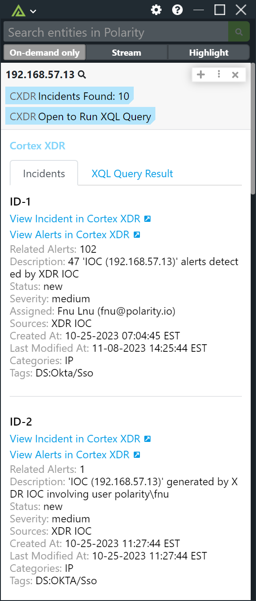
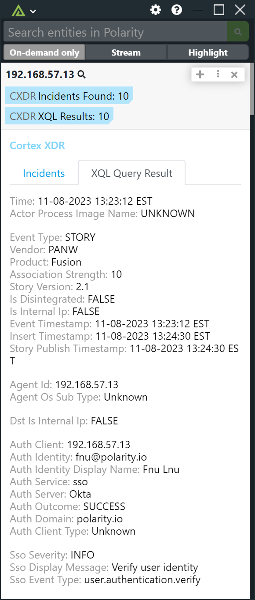
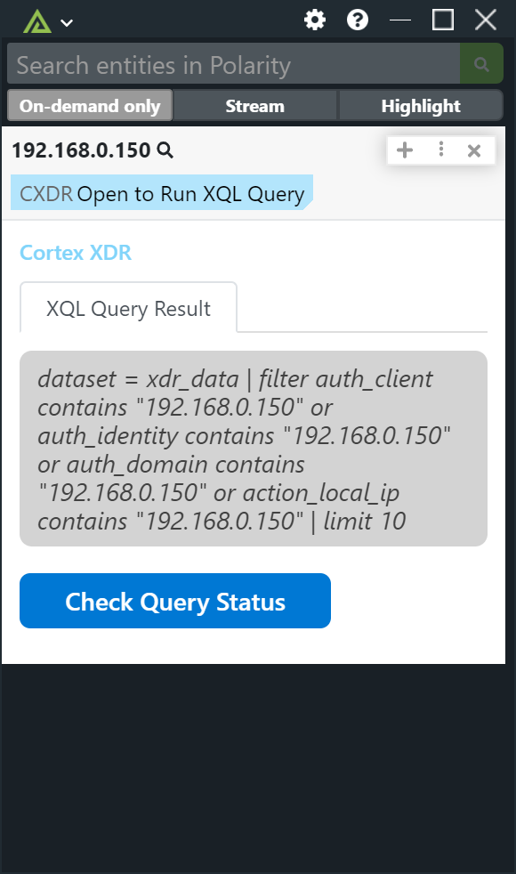
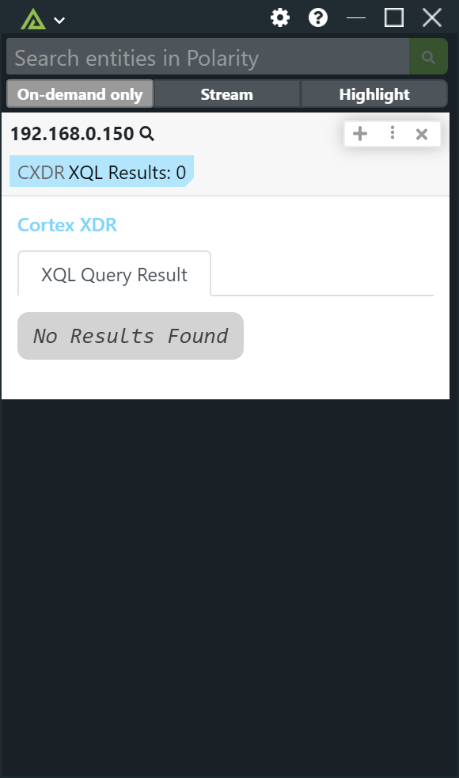

# Polarity Cortex XDR Integration

Cortex XDR allows you to safeguard your organization with proven endpoint security, detection, response, automation and attack surface management.

The Polarity Cortex XDR Integration allows you to search for Incidents, and XQL Queries.

  
  

  
  

To learn more about Cortex XDR, visit the [official website](https://www.paloaltonetworks.com/cortex/cortex-xdr).

> ***NOTE:*** If you would like us to display more fields for XQL Queries, please reach out to support@polarity.io.  
> We are happy to add additional fields as requested.

## Cortex XDR Integration Options

### API URL
The API Url for your Cortex XDR instance. Configuration -> API Key -> Copy API URL

### API Key
An API Key on your Cortex XDR instance. Configuration -> API Key

### API Key ID
The ID associated with your API Key. Configuration -> API Key -> ID Column

### Do XQL Queries
Check if you want to run XQL Queries with the XQL Query String

### XQL Query String
The XQL Query you want to use when Searching Entities. Example: `dataset = xdr_data | filter agent_id contains "{{ENTITY}}" or agent_hostname contains "{{ENTITY}}" or agent_ip_addresses contains "{{ENTITY}}"  | limit 10`

## Installation Instructions
Installation instructions for integrations are provided on the [PolarityIO GitHub Page](https://polarityio.github.io/).

## Polarity
Polarity is a memory-augmentation platform that improves and accelerates analyst decision making. For more information about the Polarity platform please see:

https://polarity.io/
